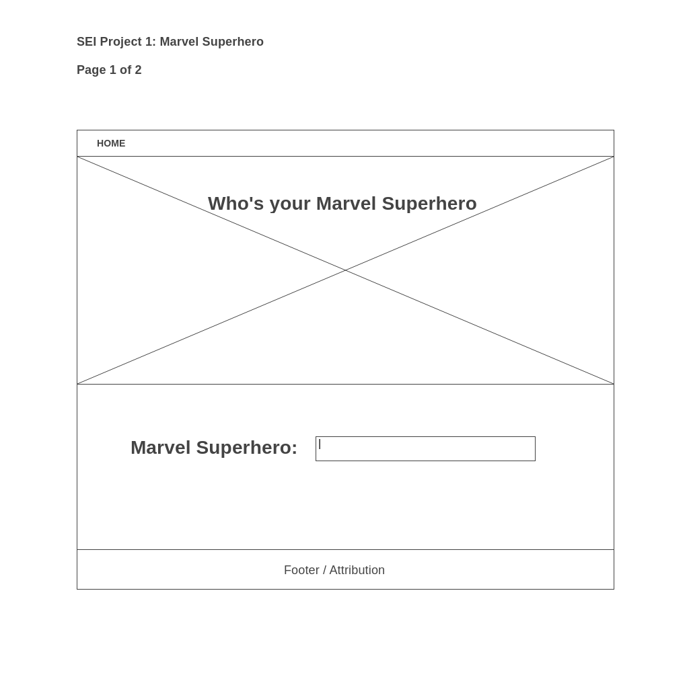
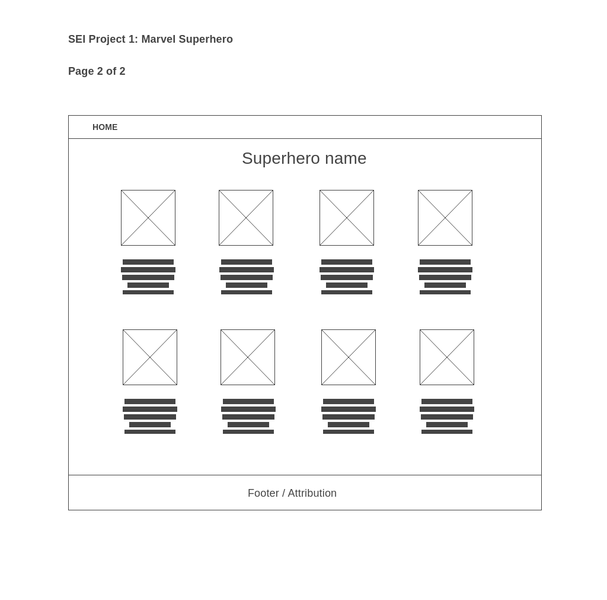

# P1_Superheros
GA Project 1

---------------------
 Title:
---------------------
  Super Heros Lookup

---------------------
  Description: 
---------------------
1. User enters a superhero's name or first few characters of the name.
2. Retrieves a list of superhero data that matches user input.
3. Data will include superhero image, name, description, etc.
4. Display image and data in column/row format

---------------------
Wireframes 
--------------------
	Page 1: Master
	Page 2: Superhero image and desciptions

---------------------
  API: 
---------------------
	Mavel API: The Marvel Comics API’s base endpoint is http(s)://gateway.marvel.com/

	API Limitation (free account): 1000 per day

	API Attribution: https://developer.marvel.com/documentation/attribution
	   Must include attribution on all web pages: "Data provided by Marvel. © 2014 Marvel"
  	   Linking back to Marvel if displaying thumbnail width greater than 100px 

	API Documentation
	   https://developer.marvel.com/
  	   https://developer.marvel.com/docs#!/public/getCharacterIndividual_get_1

---------------------
  MVP Features
---------------------

	1. Header navigation bar
	2. Handle user input
	3. Handle event handler
	4. API call to retrieve and display superhero image and description.
	5. DOM update
	6. Customize display format on desktop, tablet and iphone (css stylesheet)

---------------------
  POST MVP: 
---------------------
	1. If user clicks on image, enlarge superhero image (API has image in mulitple sizes)
	2. Add list menu option for additional superhero category info (comic book, movie)
	3. Make additonal API call to retrieve additional superhero information.

